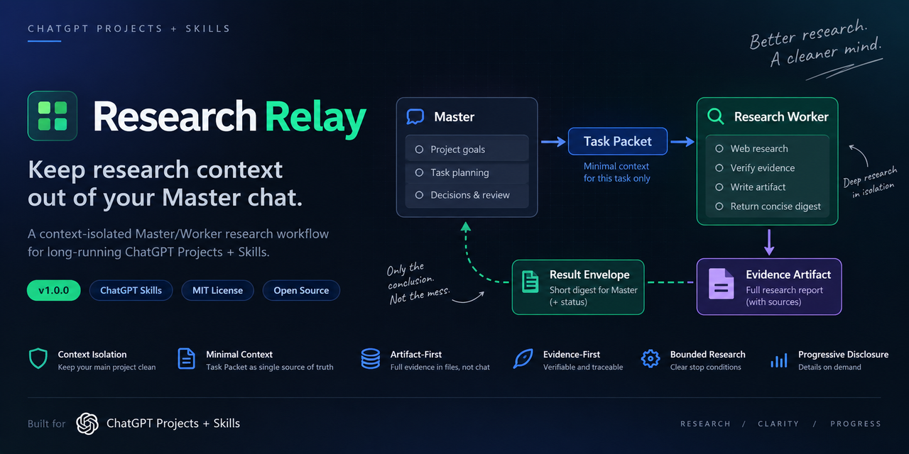

# Research Relay

**让研究上下文留在 Worker，而不是不断堆进你的 Master Chat。**



[English](README.md) · [安装说明](docs/installation.md) · [架构说明](docs/architecture.md) · [示例](examples/task-packet.md) · [Discussions](https://github.com/qq2638622037-glitch/chatgpt-research-relay/discussions)

[](https://github.com/qq2638622037-glitch/chatgpt-research-relay/releases/latest)
[](LICENSE)
[](https://github.com/qq2638622037-glitch/chatgpt-research-relay/stargazers)


> **一套面向长期 ChatGPT Projects + Skills 的 Master / Worker 上下文隔离研究工作流。**

> **独立项目声明：** Research Relay 是一个独立的开源项目，与 OpenAI 不存在隶属、合作、背书或赞助关系。“ChatGPT”仅用于说明本项目当前适用的使用环境。

Research Relay 将**长期项目上下文**和**临时研究过程**分离开来。

你的 Master 负责保存：

* 长期目标；
* 已做出的决定；
* 项目约束；
* 项目状态；
* 真正值得长期保留的信息。

Research Worker 则只接收：

> **完成当前这一项研究任务真正需要的最小上下文。**

Worker 独立完成搜索、验证、冲突处理和证据整理，并把详细研究保存在 Evidence Artifact 中。

最终只把一个很短的 Result Envelope 返回 Master。

> **不要再把整个项目历史发送给每一次研究任务。**

---

# 快速开始

Research Relay 由两个互相配合的 Skill 组成：

* **`research-dispatcher`** —— 安装并使用在你的 **Master Project**
* **`research-worker`** —— 安装并使用在独立的 **Research Worker Project**

## 1. 下载

前往最新 Release：

**[→ Research Relay — Latest Release](https://github.com/qq2638622037-glitch/chatgpt-research-relay/releases/latest)**

在 Assets 中下载：

* `research-dispatcher-v1.1.0.zip`
* `research-worker-v1.1.0.zip`

真实安装测试已确认：Release 中的原始 ZIP 可以直接上传到 ChatGPT Skills，不需要先改名成 `skill.zip`，也不需要重新压缩。详细步骤见 [`docs/installation.md`](docs/installation.md)。

## 2. 建立两个不同角色

```text
MASTER PROJECT
    │
    │  research-dispatcher
    │
    └── 生成最小充分 Task Packet
              │
              ▼
      RESEARCH WORKER PROJECT
              │
              │  research-worker
              │
              ├── 联网研究与核验
              ├── 生成 Evidence Artifact
              └── 返回短 Result Envelope
                          │
                          ▼
                     MASTER PROJECT
```

Master 保存长期项目上下文。

Worker 只接收当前任务真正需要的信息。

## 3. 执行第一项研究任务

在 Master Project 中，让 Research Relay 把某个局部研究问题委派出去。

`research-dispatcher` 会生成一个 **Task Packet**。

这个 Packet 应当只包含当前 Worker 真正需要知道的信息，而不是你的整个项目历史。

把 Task Packet 复制到 Research Worker Project。

`research-worker` 会：

1. 检查 Packet 是否可以执行；
2. 根据 Packet 联网研究；
3. 核验来源；
4. 记录冲突和缺失证据；
5. 生成完整 Evidence Artifact；
6. 返回简短 Result Envelope。

最后，把 Result Envelope 返回 Master。

正常情况下 Master 仍然只做 Result Envelope intake；当 `CONFLICTING`、用户审计或其他规则真的要求打开完整 Artifact 时，v1.1 会优先尝试直接引用。如果跨 Chat / Project 的直接引用不可访问，则可通过确定性文件名 `<task_id>_evidence.md` 在 ChatGPT Library 中定位并校验对应 Artifact，而不是立刻要求用户手工下载再上传。

> **详细研究过程留在 Worker。真正影响项目决策的结果才返回 Master。**

## 使用要求

当前版本面向：

* ChatGPT Projects
* ChatGPT Skills
* 推荐使用两个独立 Project / 上下文

不要求：

* ChatGPT Work
* Codex
* 外部 Agent Runtime
* Google Drive
* 自建服务器

---

# 使用 Research Relay 前后有什么区别？

## 没有 Research Relay

长期运行的 Master Chat 很容易逐渐变成这样：

```text
MASTER CHAT

项目目标
长期决策
历史上下文

网络搜索
搜索结果
失败线索
来源核验
冲突证据
中间结论
详细研究笔记

最终结论

更多搜索……
更多资料……
更多上下文……
更多历史……
```

长期项目真正需要保留的信息，与一次性研究产生的大量临时上下文，全都堆积在同一个 Chat 中。

时间越长，Master 就越臃肿。

---

## 使用 Research Relay

```text
MASTER PROJECT
│
├── Goals
├── Decisions
├── Constraints
├── Long-term project state
│
└── Task Packet
        │
        ▼
════════════ CONTEXT FIREWALL ════════════
        │
        ▼
RESEARCH WORKER
│
├── Searches
├── Verification
├── Failed leads
├── Conflicting evidence
├── Detailed findings
│
├── Evidence Artifact
│      └── 完整研究留在这里
│
└── Result Envelope
       └── 只有短结果返回
               │
               ▼
          MASTER PROJECT
```

| 普通长期项目              | Research Relay                |
| ------------------- | ----------------------------- |
| 研究直接发生在 Master Chat | 研究发生在独立 Worker                |
| 可能反复携带完整项目历史        | Worker 只得到最小 Task Packet      |
| 搜索噪声持续进入 Master     | 详细研究进入 Artifact               |
| 缺失证据容易被忽略           | 缺失、失败与冲突必须显式暴露                |
| Master 接收完整研究过程     | Master 默认只接收短 Result Envelope |
| 每次研究都继续增加长期上下文      | 临时研究上下文被隔离                    |

> **长期项目知识留在 Master。临时研究工作留给 Worker。**

---

# 为什么需要 Research Relay？

长期 ChatGPT 项目通常会同时积累两类完全不同的信息。

## 项目上下文

例如：

* 项目目标；
* 长期规划；
* 已确认事实；
* 用户要求；
* 历史决策；
* 重要约束；
* 当前项目状态。

这些内容往往应该长期保留。

## 研究上下文

例如：

* 搜索关键词；
* 网页结果；
* 无效线索；
* 来源核验；
* 相互冲突的资料；
* 临时推断；
* 中间结果；
* 失败路径。

这些内容通常只对当前研究任务有价值。

如果两类东西一直存在同一个 Master Chat：

> Master 会越来越像“研究日志”，而不是“项目控制中心”。

Research Relay 的核心目标，就是把两者分开。

```text
MASTER PROJECT
   │
   │ research-dispatcher
   │
   │ Minimal Task Packet
   ▼
════════════ CONTEXT FIREWALL ════════════
   ▼
RESEARCH WORKER
   │
   ├── Web research
   ├── Verification
   ├── Evidence Artifact
   │
   └── Result Envelope
              │
              ▼
         MASTER PROJECT
```

Research Relay 优化的是：

> **上下文隔离与信息流。**

它不是为了绕过账户限制、模型限制，也不是“无限节省 Token”的工具。

正确性和可核验性仍然优先于上下文成本。

---

# 核心设计原则

## 1. Master owns the project; Worker owns only the task.

Master 拥有整个项目。

Worker 只拥有当前任务。

Worker 不应该自行接管：

* 项目长期目标；
* 项目优先级；
* 全局决策；
* Master 历史；
* 其他未授权任务。

---

## 2. Task Packet 是当前任务的单一真源

Worker 执行当前任务时，以 Task Packet 为准。

不能因为 Worker Project 以前研究过类似问题，就自动继承旧结论。

---

## 3. 默认只传最小充分上下文

Dispatcher 在生成 Packet 时会不断检查：

> 如果删除这条信息，Worker 是否仍然能够正确搜索、理解证据并完成任务？

如果答案是“可以”，这条信息通常就不应该进入 Packet。

---

## 4. 旧 Chat 和旧 Artifact 默认不可复用

只有 Task Packet 在 `artifact_inputs` 中明确点名的旧材料，Worker 才应该把它们作为当前任务输入。

Worker 历史不是默认知识库。

---

## 5. Artifact-first

详细证据应该进入 Evidence Artifact。

而不是把几十页研究过程重新塞回 Master。

---

## 6. Master 默认只接收 Result Envelope

Master 首先读取：

* status；
* confidence；
* master_digest；
* key findings；
* conflicts；
* unresolved；
* recommended next action。

只有需要深入检查时，才进一步打开 Artifact。

v1.1 的 Artifact Resolver 只在 Artifact-read gate 被触发后工作。普通 `COMPLETE`、常规 `PARTIAL`、`BLOCKED` 和 `NO_EVIDENCE` 不会仅仅因为存在 Artifact 就主动搜索 Library。

---

## 7. Evidence over claims

Research Relay 更重视：

* 来源；
* 可验证证据；
* 明确的不确定性；
* 冲突；
* 缺失信息；

而不是让 Worker 看起来“什么都知道”。

---

## 8. Explicit Failure

研究没有完成，就应该明确说没有完成。

支持：

* `COMPLETE`
* `PARTIAL`
* `BLOCKED`
* `CONFLICTING`
* `NO_EVIDENCE`

Worker 不应该为了“交差”，把不完整研究包装成 `COMPLETE`。

---

## 9. Bounded Research

研究不是无限循环。

Task Packet 应明确：

* scope；
* research budget；
* refinement rounds；
* stop conditions。

证据已经充分时，应当停止。

达到预算仍无法闭合时，也应停止，并返回正确的非 COMPLETE 状态。

---

# 两个 Skill

## `research-dispatcher`

运行在 Master Project。

它负责：

* 判断一个任务是否值得委派；
* 从长期上下文中提取最小必要信息；
* 创建版本化 Task Packet；
* 避免直接搬运整个聊天历史；
* 必要时把超大任务拆成多个不重叠任务；
* 接收 Worker 返回的 Result Envelope；
* 做轻量完整性检查；
* 只有必要时才读取 Evidence Artifact；
* 审计需要 Artifact 且直接引用失效时，优先用确定性文件名通过 ChatGPT Library 恢复，再考虑人工 handoff。

它的原则是：

> **Master owns the project; Worker owns only the task.**

---

## `research-worker`

运行在 Research Worker Project。

它负责：

* 把当前 Task Packet 作为任务真源；
* 检查 Packet 是否可执行；
* 制定最小研究计划；
* 联网搜索和核验；
* 优先使用直接、当前、可追溯的证据；
* 显式记录冲突；
* 显式记录失败和缺失证据；
* 创建完整 Evidence Artifact；
* 保持 `<task_id>_evidence.md` 的确定性命名；
* 返回简短 Result Envelope。

Worker 不应该自行修改 Master 的项目目标。

也不能因为同一个 Worker Project 以前聊过某件事，就自动继承旧结论。

---

# Task Packet 示例

Task Packet 使用：

```text
research-task/v1
```

一个基础示例：

```yaml
protocol: research-task/v1
task_id: RR-20260917-001

objective: "确认某个具体产品行为是否存在当前第一方资料支持。"

decision_use: "帮助 Master 判断该行为是否可以作为项目中的已确认假设。"

known_facts:
  - fact: "用户曾在一次实际测试中观察到这个行为。"
    status: user_observation

questions:
  - "当前第一方资料是否明确记录这个行为？"
  - "是否存在可信的矛盾证据？"

scope:
  include:
    - "当前版本文档和直接相关证据"
  exclude:
    - "无关的旧版本资料"

constraints:
  - "搜索摘要不能作为最终证据。"

artifact_inputs: []

source_policy:
  priority:
    - "第一方官方资料"
    - "可直接复现的证据"
  required: []
  forbidden: []
  freshness: "优先当前版本资料"

research_budget:
  depth: standard
  max_refinement_rounds: 2

output_contract:
  artifact_required: true
  artifact_target: "chat_file"
  master_digest_max_chars: 600
  expose_conflicts: true
  expose_uncertainty: true

stop_conditions:
  - "证据已经足以回答所有影响决策的问题。"
  - "研究预算耗尽；如果仍无法闭合，应返回正确的非 COMPLETE 状态。"
```

Task Packet 不是：

> Master Chat 的压缩摘要。

它应该是：

> **当前任务的最小充分上下文。**

---

# Result Envelope

Worker 完成研究后，会返回：

```text
research-result/v1
```

示意结构：

```yaml
protocol: research-result/v1
task_id: RR-20260917-001

status: COMPLETE
confidence: HIGH

master_digest: "Master 真正需要知道的短结论。"

key_findings:
  - "关键发现"

conflicts: []

unresolved: []

recommended_next_action:
  - "下一步建议"

artifact_ref: "完整 Evidence Artifact 的位置或确定性文件名"
```

Result Envelope 不承担完整论证。

它的任务只是：

> **让 Master 用尽可能少的信息知道这次研究到底得出了什么。**

---

# Result 状态

Research Relay 当前使用：

### `COMPLETE`

证据足够，所有影响决策的核心问题已经闭合。

### `PARTIAL`

已经获得重要信息，但至少有一个关键问题仍未闭合。

### `BLOCKED`

由于访问限制、缺少必要输入或其他阻塞原因，无法继续执行。

### `CONFLICTING`

高质量证据之间存在无法在当前研究预算内解决的实质性冲突。

### `NO_EVIDENCE`

经过合理搜索后，没有找到足以支持目标结论的证据。

> Worker 不应该把 `PARTIAL` 写成 `COMPLETE`，只为了让结果看起来更漂亮。

---

# Evidence Artifact

详细研究进入 Evidence Artifact。

默认可以包含：

1. Task
2. Executive Finding
3. Scope & Method
4. Question-by-Question Findings
5. Evidence Table
6. Contradictions / Competing Evidence
7. Negative / Missing Evidence
8. Unresolved Questions
9. Suggested Follow-up / User Test
10. Source Index

Artifact 保存的是：

- 可复查证据；
- 明确结论；
- 明确推断；
- 来源；
- 冲突；
- 不确定性；
- provenance。

它不应该保存隐藏思维链。

Master 首先看 Result Envelope。

只有在以下情况才需要深入打开 Artifact：

- 需要审计；
- 出现证据冲突；
- 需要重新验证；
- 结果异常；
- 用户明确要求查看完整依据。

v1.1 的默认恢复顺序是：当前 Chat 中可访问的 `artifact_ref` → 精确 `<task_id>_evidence.md` 的 ChatGPT Library 匹配并校验 task_id / objective → 显式配置的持久 connector → 最后的人工下载 / 上传 fallback。

---

# 项目结构

```text
chatgpt-research-relay/
├── README.md
├── README.zh-CN.md
├── LICENSE
├── CHANGELOG.md
├── CONTRIBUTING.md
├── research-relay-hero.png
│
├── research-dispatcher/
│   ├── SKILL.md
│   ├── agents/
│   └── references/
│
├── research-worker/
│   ├── SKILL.md
│   ├── agents/
│   └── references/
│
├── examples/
└── docs/
    ├── installation.md
    ├── architecture.md
    └── pressure-tests.md
```

---

# 设计选择

Research Relay 有意保持简单。

当前核心流程不要求：

* 外部 Agent Runtime；
* ChatGPT Work；
* Codex；
* Google Drive；
* 独立自动 Auditor；
* 核心协议脚本。

这是有意的设计选择，而不是缺失功能。

当前已经验证的是：

> **Master / Worker 上下文隔离这套工作流可以工作，而且 v1.1 能在需要审计时减少 Artifact 人工搬运。**

未来版本可能根据真实使用反馈加入：

* Task Packet schema validator；
* Result Envelope validator；
* 更完善的自动化 Relay；
* 可选 Research Auditor；
* 更多真实案例。

但这些功能应该来自真实需求，而不是为了让项目“看起来更复杂”。

---

# Pressure Tests

Research Relay 在发布前针对以下类型进行了协议级压力测试：

1. 简单事实核验；
2. Master 上下文过大；
3. 来源互相冲突；
4. 无证据场景；
5. 特定领域来源限制；
6. Worker 返回结果过长；
7. Worker 历史污染；
8. Master 轻量结果接收。

此外，v1.1 candidate 已真实回归：

* 两个 Skill 安装；
* `COMPLETE` Envelope-only，不读 Artifact、不调用 Library Resolver；
* `CONFLICTING` 跨 Project Artifact 通过 Library 自动恢复，不需要用户手工搬运；
* `artifact_inputs: []` 时 Worker Context Firewall 继续有效。

测试重点不是：

> Worker 能不能搜索到东西。

而是：

> **在保持研究质量的同时，Research Relay 能不能真正隔离研究上下文。**

详细内容见：

[`docs/pressure-tests.md`](docs/pressure-tests.md)

---

# 当前阶段

Research Relay `v1.1.0` 已进入正式 Release 准备阶段。

当前已经包括：

* `research-dispatcher`
* `research-worker`
* Task Packet 协议
* Result Envelope 协议
* Evidence Artifact
* ChatGPT Library Artifact Resolver
* README
* 安装说明
* 架构说明
* 示例
* Pressure Tests
* MIT License
* Discussions

核心行为已经完成真实回归，下一条长期路线是：

> **继续减少 Task Packet / Result Envelope 的手工复制，逐步研究自动 Master → Worker → Master orchestration，同时保持 Context Firewall。**

---

# Feedback & Discussions

如果你实际使用 Research Relay，非常欢迎反馈。

尤其希望知道：

* 你在什么项目中使用它？
* Dispatcher 是否仍然发送了过多上下文？
* Task Packet 是否遗漏重要信息？
* Worker 是否受到旧聊天历史污染？
* Result Envelope 是太长还是太短？
* Artifact 是否足够方便审查？
* 哪些研究任务无法正确完成？
* Artifact transport 或 orchestration 还有哪些手工摩擦？

**[→ 加入 GitHub Discussions](https://github.com/qq2638622037-glitch/chatgpt-research-relay/discussions)**

真实失败案例尤其有价值。

后续功能优先级应该来自：

1. 真实 E2E 失败；
2. 用户 Discussion / Issue；
3. 安装摩擦；
4. Context leakage；
5. Result Envelope 问题；
6. Task Packet 冗余或缺失；
7. Artifact 审计问题；
8. Stop conditions 问题；
9. 最后才是单纯“看起来更高级”的功能。

---

# Acknowledgements

Research Relay 的设计过程中参考和研究过多个公开项目与公开资料中关于：

* Skills；
* Projects；
* Handoffs；
* Progressive Disclosure；
* Subagents；
* Deep Research；
* Context Engineering；

等方向的设计思想。

这些参考帮助我们理解已有工作中的优秀模式和潜在问题。

Research Relay 最终采用的是自己的：

* Master / Worker 分工；
* Task Packet；
* Context Firewall；
* Artifact-first；
* Result Envelope；
* Explicit Failure；
* Bounded Research；

工作流。

Research Relay 是独立开源项目，与 OpenAI 或其他被参考项目不存在隶属、合作、背书或赞助关系。

---

# Contributing

特别欢迎以下类型的反馈：

* Task Packet 中多余或缺失的字段；
* Dispatcher 发送过多上下文的场景；
* Worker 历史污染案例；
* 证据策略边缘情况；
* Result Envelope 长度与可用性问题；
* Artifact 审计问题；
* 协议在真实长期项目中失效的案例。

详见：

[`CONTRIBUTING.md`](CONTRIBUTING.md)

---

# License

MIT License。

详见 [`LICENSE`](LICENSE)。

---

**English README:** [`README.md`](README.md)
